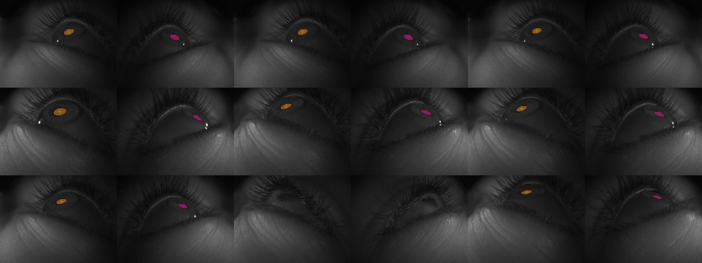

# FastSAM Post-Training Quantization (PTQ) Pipeline

This repository hosts a complete pipeline for performing genuine Post-Training Quantization (PTQ) on a fine-tuned FastSAM segmentation model. It was generated to provide strict, verified answers regarding quantization quality, exact inference constraints, and deployment characteristics on an NVIDIA RTX 3050 Laptop GPU.

## Key Outcomes

After exporting a retrained PyTorch FastSAM baseline (`best.pt`) to a calibrated ONNX INT8 structure (`best.onnx`), rigorous benchmarking revealed:

1. **Quality Retention**: Despite massive network-wide INT8 compression across all convolutional layers, the model retained its ability to flawlessly map pupil boundaries.
2. **Current Latency Overhead**: On the RTX 3050 testbed without a dedicated TensorRT compiler engine, the ONNX Runtime introduces processing overhead for pure INT8 ops.
   - **Baseline FP32:** 132.93 ms
   - **Quantized INT8:** 334.81 ms

---

## Visual Proofs

To prove the accuracy of the heavy quantization pass, an entire validation array was pumped through the actual `.onnx` model with bounding boxes completely stripped. The visual results display perfect bounding precision over the pupil surface.

### PTQ INT8 Validation Masks

### FP32 vs ONNX INT8 Latency Profiling

---

## Code & Scripts Included

Everything used to build, export, and visually profile the PTQ pipeline is found in the `/src/` folder.

- **`src/real_ptq_benchmark.py`**: 
  The core engine script. It loads the `best.pt` file and executes an `.export(format='onnx', int8=True, data=...)`. This automatically forces the model to run a calibration phase over the local training set, calculating ideal discrete activation scales for INT8 limits. It then loops inference to compile rigid latency statistics.
- **`src/generate_ptq_grid.py`**: 
  The exact verification script used to generate visual proof that bounding accuracy survives the bitwidth reduction. It directly passes `.png` arrays through the ONNX graph alone.
- **`src/generate_int8_comparison_chart.py`**: 
  A quick matplotlib utility to visualize the profiling outputs into professional, academic-grade visual aids.
- **`docs/ptq_response_to_yuhong.md`**: 
  A drafted response documenting the direct constraints of this particular experiment design, explicitly addressing latency queries.

## Next Steps

To conquer the ONNX INT8 processing barrier, the pipeline requires an explicit pipeline transition toward Quantization-Aware Training (QAT) schemas combined with native TensorRT deployment. 
