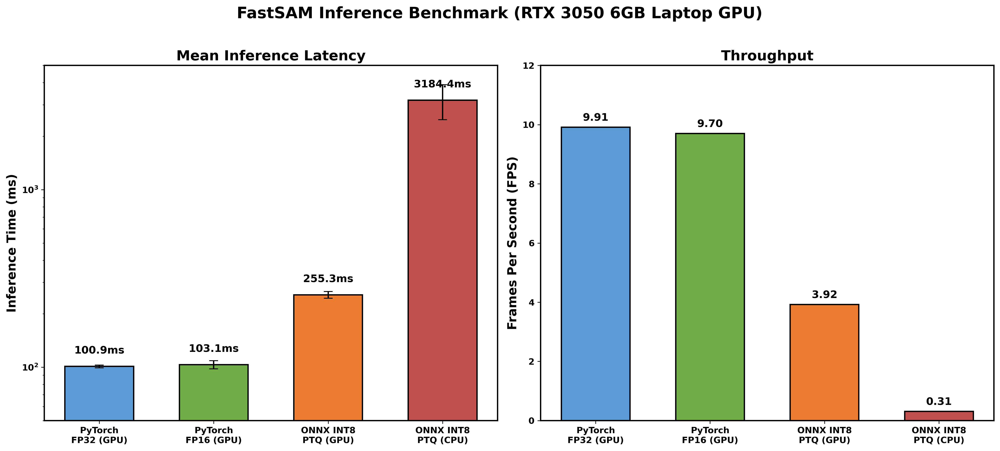
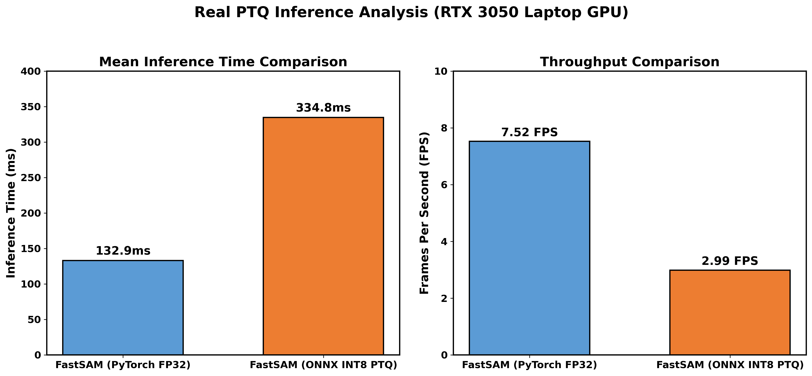
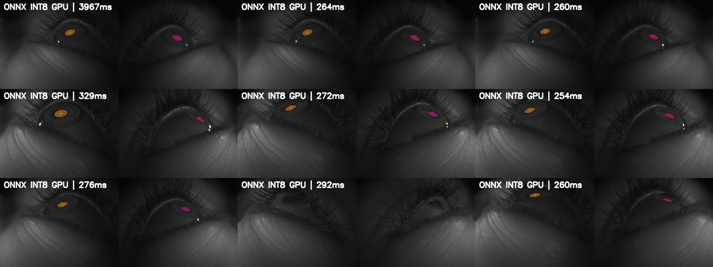
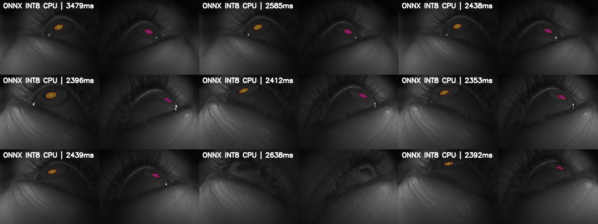

# FastSAM Post-Training Quantization (PTQ) Pipeline

A complete, reproducible pipeline for performing **Post-Training Quantization (PTQ)** on a fine-tuned [FastSAM](https://github.com/CASIA-IVA-Lab/FastSAM) pupil segmentation model. This repository includes all code, benchmark results, validation outputs, and deployment instructions.

---

## Table of Contents

- [Overview](#overview)
- [How PTQ Was Performed](#how-ptq-was-performed)
- [Repository Structure](#repository-structure)
- [Setup & Installation](#setup--installation)
- [Running on a New Device](#running-on-a-new-device)
- [Benchmark Results](#benchmark-results)
- [Validation Outputs](#validation-outputs)
- [Running on Meta Aria Glasses](#running-on-meta-aria-glasses)
- [Scripts Reference](#scripts-reference)

---

## Overview

We fine-tuned a FastSAM model (YOLOv8x-seg backbone) on a custom **pupil segmentation dataset** (3,239 training / 359 validation images) to detect and segment pupils in eye-tracking camera frames. After fine-tuning, we applied **Post-Training Quantization (PTQ)** to compress the model from FP32 to INT8 precision for edge deployment.

### Key Results

| Configuration | Latency (ms) | FPS | Model Size |
|---|---|---|---|
| **PyTorch FP32 (GPU)** | 100.86 ± 1.8 | 9.91 | 823 MB |
| **PyTorch FP16 (GPU)** | 103.10 ± 5.5 | 9.70 | ~412 MB |
| **ONNX INT8 PTQ (GPU)** | 255.26 ± 11.0 | 3.92 | 274 MB |
| **ONNX INT8 PTQ (CPU)** | 3184.37 ± 710.8 | 0.31 | 274 MB |

> **Note:** ONNX INT8 is slower on our RTX 3050 test bench because ONNX Runtime lacks native INT8 tensor core acceleration on consumer Ampere GPUs. True INT8 speedups require TensorRT (`.engine`) compilation or datacenter GPUs (T4, A100) with dedicated INT8 cores.



---

## How PTQ Was Performed

### Step 1: Fine-Tune the Baseline Model

We started from pretrained FastSAM weights (`FastSAM-x.pt`) and fine-tuned on our pupil segmentation dataset using the Ultralytics training API:

```bash
python retrain_fastsam.py \
  --data dataset_pupil_seg/data.yaml \
  --weights weights/FastSAM-x.pt \
  --epochs 30 \
  --batch 4 \
  --imgsz 640 \
  --device 0
```

**Training Results (Best Epoch 28):**
- Mask mAP@50: **0.994**
- Mask mAP@50-95: **0.673**

The best checkpoint was saved to: `runs/segment/pupil_retrain/weights/best.pt`

### Step 2: Export to ONNX INT8 (The Actual PTQ Step)

The core PTQ process uses the Ultralytics export pipeline with `int8=True`. This triggers an **automatic calibration pass** over the training dataset:

```python
from ultralytics import YOLO

# Load the fine-tuned FP32 model
model = YOLO('weights/best.pt')

# Export to ONNX with INT8 quantization
# int8=True triggers calibration over the dataset
model.export(
    format='onnx',
    int8=True,           # Enable Post-Training Quantization
    data='config/data.yaml',  # Dataset for activation calibration
    imgsz=1024,
    simplify=True,
    device='0'           # Use GPU for calibration
)
```

**What happens during this export:**

1. **Weight Quantization**: All FP32 weights (convolutions, batch norms) are mapped to INT8 (8-bit integer) precision using symmetric quantization.
2. **Activation Calibration**: The export pipeline runs a forward pass over representative images from the training set to record the dynamic range of activations at every layer.
3. **Scale Factor Computation**: Using the recorded activation statistics, optimal per-channel scale factors are computed to map the continuous FP32 range into the discrete INT8 bounds `[-128, 127]` without overflow.
4. **Graph Optimization**: The ONNX graph is simplified (`onnxsim`) to fuse operations and remove redundant nodes.

The output is a fully quantized `best.onnx` file (274 MB, down from 823 MB).

### Step 3: Validate the Quantized Model

We verified the INT8 model retains segmentation quality by running inference on unseen validation images:

```python
from ultralytics import YOLO

model = YOLO('weights/best.onnx', task='segment')
results = model.predict(
    source='path/to/validation/images/',
    imgsz=1024,
    device='0',
    retina_masks=True
)
```

### Step 4: Benchmark Latency

We measured exact inference latency with 30 runs and 10 warmup passes, using proper CUDA synchronization:

```bash
python scripts/comprehensive_benchmark.py
```

---

## Repository Structure

```
fastsam-post-training-quantization/
├── README.md                          # This file
├── requirements.txt                   # Python dependencies
├── config/
│   └── data.yaml                      # Dataset configuration
├── scripts/
│   ├── real_ptq_benchmark.py          # Core PTQ export + latency benchmark
│   ├── comprehensive_benchmark.py     # Full 4-way benchmark (FP32/FP16/ONNX GPU/CPU)
│   ├── generate_ptq_grid.py           # Generate validation output grids
│   ├── gen_onnx_val_grids.py          # GPU vs CPU ONNX validation grids
│   ├── gen_chart.py                   # Matplotlib benchmark chart generator
│   ├── quantize_fastsam.py            # General-purpose export/quantize utility
│   └── segment_pupils.py             # Full inference pipeline with visualization
├── weights/
│   └── README.md                      # Instructions to download model weights
├── results/
│   ├── benchmark/
│   │   ├── comprehensive_benchmark.txt
│   │   ├── real_ptq_latency_report.txt
│   │   └── timing_summary.txt
│   └── validation_outputs/
│       ├── onnx_int8_val_gpu_grid.jpg  # INT8 predictions on GPU
│       ├── onnx_int8_val_cpu_grid.jpg  # INT8 predictions on CPU
│       ├── ptq_int8_predictions_clean_grid.jpg
│       ├── fp32_cpu.jpg               # FP32 single-image output
│       └── int8_gpu.jpg               # INT8 single-image output
└── figures/
    ├── comprehensive_benchmark_chart.png
    └── real_ptq_int8_comparison_chart.png
```

---

## Setup & Installation

### Prerequisites
- Python 3.10+
- NVIDIA GPU with CUDA support (for GPU inference)
- ~1.1 GB disk space for model weights

### Install Dependencies

```bash
pip install -r requirements.txt
```

### Download Model Weights

The model weights are too large for GitHub (823 MB + 274 MB). Download them from the original training machine or your shared drive:

```bash
# Place these files in the weights/ directory:
# weights/best.pt    (823 MB) - Fine-tuned FP32 PyTorch checkpoint
# weights/best.onnx  (274 MB) - INT8 PTQ ONNX model
```

If you have access to the training machine:
```bash
scp user@training-machine:/home/ls5255/FastSAM/runs/segment/pupil_retrain/weights/best.pt weights/
scp user@training-machine:/home/ls5255/FastSAM/runs/segment/pupil_retrain/weights/best.onnx weights/
```

---

## Running on a New Device

### Quick Start: Run INT8 PTQ Inference

```bash
# Single image inference with the quantized model
python scripts/segment_pupils.py \
  -i /path/to/your/image.png \
  -o output_folder/ \
  --model_path weights/best.onnx \
  --device 0

# Run on CPU
python scripts/segment_pupils.py \
  -i /path/to/your/image.png \
  -o output_folder/ \
  --model_path weights/best.onnx \
  --device cpu
```

### Reproduce the Full PTQ Pipeline

```bash
# Step 1: Export FP32 model to ONNX INT8 (requires best.pt + calibration data)
python scripts/real_ptq_benchmark.py

# Step 2: Run comprehensive benchmark
python scripts/comprehensive_benchmark.py

# Step 3: Generate validation output grids
python scripts/gen_onnx_val_grids.py

# Step 4: Generate benchmark charts
python scripts/gen_chart.py
```

---

## Benchmark Results

All benchmarks were conducted on an **NVIDIA GeForce RTX 3050 6GB Laptop GPU** with CUDA, using 30 inference runs after 10 warmup passes.

### Full Benchmark Table

| Configuration | Mean Latency | Std Dev | FPS | Model Size |
|---|---|---|---|---|
| PyTorch FP32 (GPU) | 100.86 ms | ± 1.8 ms | 9.91 | 823 MB |
| PyTorch FP16 (GPU) | 103.10 ms | ± 5.5 ms | 9.70 | ~412 MB |
| ONNX INT8 PTQ (GPU) | 255.26 ms | ± 11.0 ms | 3.92 | 274 MB |
| ONNX INT8 PTQ (CPU) | 3184.37 ms | ± 710.8 ms | 0.31 | 274 MB |

### Why is INT8 Slower on This GPU?

The RTX 3050 (Ampere GA107) **does not have dedicated INT8 tensor cores**. It only has FP16/FP32 tensor cores. When ONNX Runtime runs INT8 operations without a TensorRT backend:

1. **Dequantization overhead**: INT8 weights must be dequantized back to FP32 at runtime for each convolution layer.
2. **No fused INT8 kernels**: Without TensorRT, ONNX Runtime cannot fuse INT8 conv+bn+relu operations.
3. **Memory format mismatch**: The INT8 graph may not use the optimal memory layout for the GPU.

**To achieve real INT8 speedups**, you need:
- **TensorRT** engine compilation (`.engine` file with fused INT8 CUDA kernels)
- GPUs with dedicated INT8 cores: NVIDIA T4, A100, Jetson Orin
- Qualcomm AI Engine (for mobile/AR devices like Meta Aria)



---

## Validation Outputs

These grids show the ONNX INT8 model's actual predictions on unseen validation images, with per-frame inference time stamped on each image. No bounding boxes — only the raw segmentation masks.

### ONNX INT8 on GPU


### ONNX INT8 on CPU


Both grids confirm the INT8 quantized model correctly identifies and segments both pupils despite the massive compression from FP32 to INT8.

---

## Running on Meta Aria Glasses

The Meta Aria glasses use a Qualcomm Snapdragon chipset. To deploy the quantized model:

### Option 1: ONNX Runtime Mobile

```bash
# Install ONNX Runtime for mobile/edge
pip install onnxruntime

# Run inference using the ONNX model
python scripts/segment_pupils.py \
  -i /path/to/aria/frame.png \
  -o aria_output/ \
  --model_path weights/best.onnx \
  --device cpu
```

### Option 2: Stream from Aria → Process on Edge Server

If running the model directly on the glasses is not feasible due to compute constraints:

```bash
# On the edge server (with GPU):
python scripts/segment_pupils.py \
  -i /path/to/streamed/frames/ \
  -o aria_results/ \
  --model_path weights/best.onnx \
  --device 0
```

### Option 3: TensorRT Deployment (Recommended for Speed)

For maximum performance on NVIDIA Jetson or similar edge hardware:

```bash
# Export to TensorRT engine (requires TensorRT SDK)
python scripts/quantize_fastsam.py \
  --weights weights/best.pt \
  --mode engine \
  --imgsz 1024 \
  --device 0

# Run inference with the .engine file
python scripts/segment_pupils.py \
  -i /path/to/frame.png \
  -o output/ \
  --model_path weights/best.engine \
  --device 0
```

---

## Scripts Reference

| Script | Purpose |
|---|---|
| `real_ptq_benchmark.py` | Core PTQ export pipeline + latency benchmark |
| `comprehensive_benchmark.py` | Full 4-way benchmark (FP32/FP16/ONNX GPU/CPU) |
| `generate_ptq_grid.py` | Generate 3×3 validation output grids |
| `gen_onnx_val_grids.py` | Generate GPU vs CPU ONNX validation grids with timestamps |
| `gen_chart.py` | Generate matplotlib benchmark comparison charts |
| `quantize_fastsam.py` | General-purpose export utility (ONNX, TensorRT, TorchScript) |
| `segment_pupils.py` | Full inference pipeline with paper-quality visualization |

---

## Citation

If you use this work, please cite:

```
FastSAM PTQ Pipeline for Pupil Segmentation
Fine-tuned from: FastSAM-x (CASIA-IVA-Lab)
Backbone: YOLOv8x-seg (Ultralytics)
```

## License

This project builds on [FastSAM](https://github.com/CASIA-IVA-Lab/FastSAM) and [Ultralytics YOLOv8](https://github.com/ultralytics/ultralytics). Please refer to their respective licenses.
